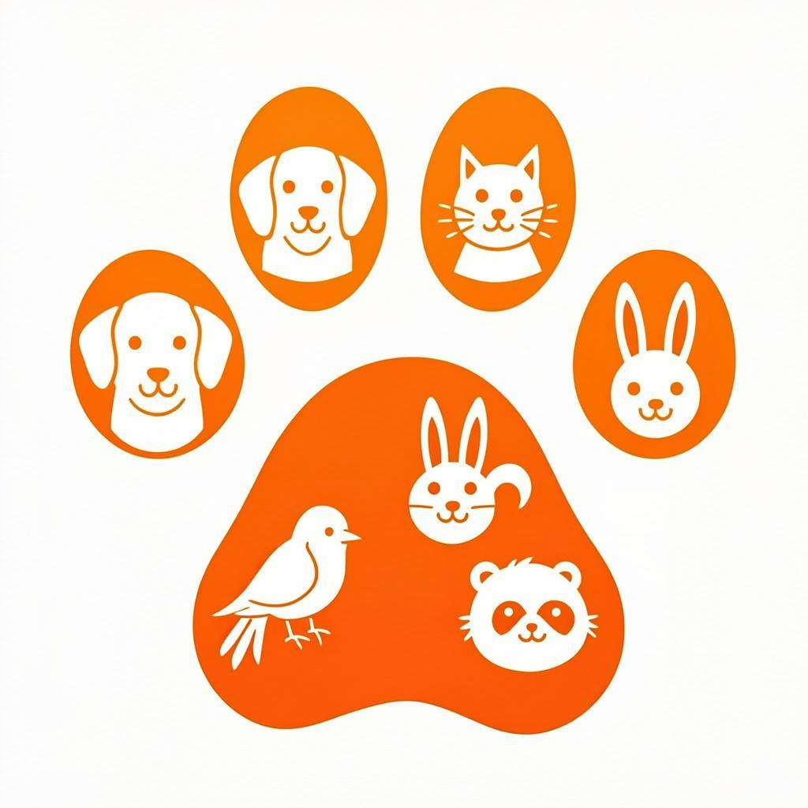

# 🐾 Accverse - A Pet-Centric Social Network

<div align="center">



**Where animals take center stage**

[](https://nextjs.org/)
[](https://www.typescriptlang.org/)
[](https://tailwindcss.com/)
[](https://supabase.com/)

</div>

---

## 📖 About

Accverse is an innovative mobile application designed exclusively for animal lovers. It's a unique social network where animals take center stage — no human selfies, just pure animal love.

### ✨ Key Features

- 🐕 **Pet Profiles** — Create detailed profiles for each pet with QR codes
- 📰 **Calm Feed** — Posts written from the pet's perspective
- 🏥 **Health Tracking** — Vaccines, treatments, and medical records
- 📸 **Photo Gallery** — Private albums for your pets
- 🚨 **Lost Mode** — Emergency QR sharing for lost pets
- 🎯 **Outings** — Animal-led meetups with smart compatibility filters
- 🗺️ **Professional Map** — Find vets, groomers, trainers, and more

---

## 🚀 Getting Started

### Prerequisites

- Node.js 18+
- Bun or npm
- Supabase account

### Installation

1. **Clone the repository**
   ```bash
   git clone https://github.com/ACCVERSE/accverse-appli.git
   cd accverse-appli
   ```

2. **Install dependencies**
   ```bash
   bun install
   ```

3. **Set up environment variables**
   ```bash
   cp .env.example .env.local
   ```
   
   Edit `.env.local` with your Supabase credentials:
   ```env
   NEXT_PUBLIC_SUPABASE_URL=your-supabase-url
   NEXT_PUBLIC_SUPABASE_ANON_KEY=your-supabase-anon-key
   ```

4. **Set up Supabase database**
   - Go to Supabase SQL Editor
   - Run the schema from `supabase/schema.sql`

5. **Start development server**
   ```bash
   bun run dev
   ```

---

## 🏗️ Project Structure

```
src/
├── app/                    # Next.js App Router pages
├── components/             # React components
│   └── ui/                # shadcn/ui components
├── hooks/                  # Custom React hooks
├── lib/                    # Utilities and configurations
│   ├── supabase/          # Supabase client configuration
│   ├── types.ts           # TypeScript type definitions
│   └── mock-data.ts       # Sample data for development
└── styles/                # Global styles
```

---

## 🛠️ Tech Stack

| Category | Technology |
|----------|------------|
| **Frontend** | Next.js 16, React, TypeScript |
| **Styling** | Tailwind CSS, shadcn/ui |
| **Backend** | Supabase (PostgreSQL, Auth, Storage) |
| **Deployment** | Vercel |

---

## 📱 Features Overview

### For Pet Owners (Free)

| Feature | Description |
|---------|-------------|
| Pet Profiles | Create unlimited pet profiles with photos |
| Calm Feed | Share moments from your pet's perspective |
| Health Records | Track vaccines, treatments, observations |
| Photo Albums | Private galleries for each pet |
| Lost Mode | Emergency QR sharing for lost pets |
| Outings | Organize and join pet meetups |

### For Professionals (Paid Tiers)

| Tier | Price | Features |
|------|-------|----------|
| Free | €0 | Basic listing, 1 service |
| Starter | €9/mo | Priority placement, verified badge, 5 photos |
| Pro | €19/mo | Direct bookings, push notifications, analytics |
| Premium | €39/mo | Multi-animal management, blockchain tracking |

---

## 🔐 Security & Privacy

- 🔒 **Row-Level Security (RLS)** on all database tables
- 🔐 **End-to-end encryption** for sensitive documents
- 🛡️ **GDPR compliant** data handling
- 📍 **Privacy-first** design approach

---

## 🗺️ Roadmap

- [ ] Mobile app (iOS/Android)
- [ ] GPS collar integration
- [ ] Blockchain-based immutable records
- [ ] Multi-language support
- [ ] AI-powered pet recognition

---

## 🤝 Contributing

Contributions are welcome! Please feel free to submit a Pull Request.

---

## 📄 License

This project is proprietary. All rights reserved.

---

<div align="center">

Made with ❤️ for animals everywhere

**[Accverse](https://github.com/ACCVERSE/accverse-appli)** © 2024

</div>
